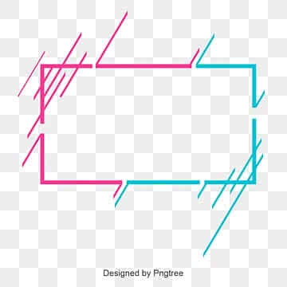

# Product Documentation

Welcome to the product documentation presentation.  
Author: 24ds1000138@ds.study.iitm.ac.in

---

<!-- Background Image Slide -->
<!-- Background image using Marp directive -->
<!-- Make sure the image exists in the images folder -->
# Feature Overview

This slide demonstrates a background image.

---

# Algorithmic Complexity

We define the complexity of our main algorithm as:

$$
T(n) = O(n \log n)
$$

Where:
- \( n \) = number of input elements
- \( O(n \log n) \) = average runtime complexity

---

# Custom Styling Example

<!-- Using Marp directives -->
<!-- Change slide background and text color -->
<!-- backgroundColor and color can be used -->
<!-- Can also use classes from custom.css -->
<!-- Example: class: lead -->
# Key Benefits
- Maintainable documentation
- Version-controlled slides
- Easy export to PDF/PPTX
- Responsive design
